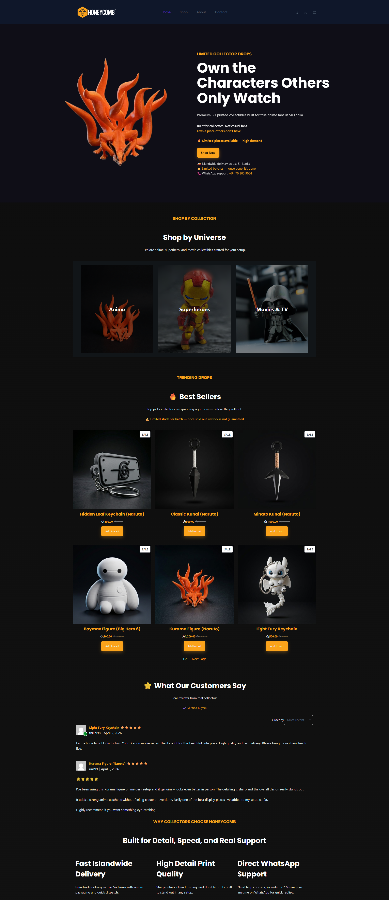
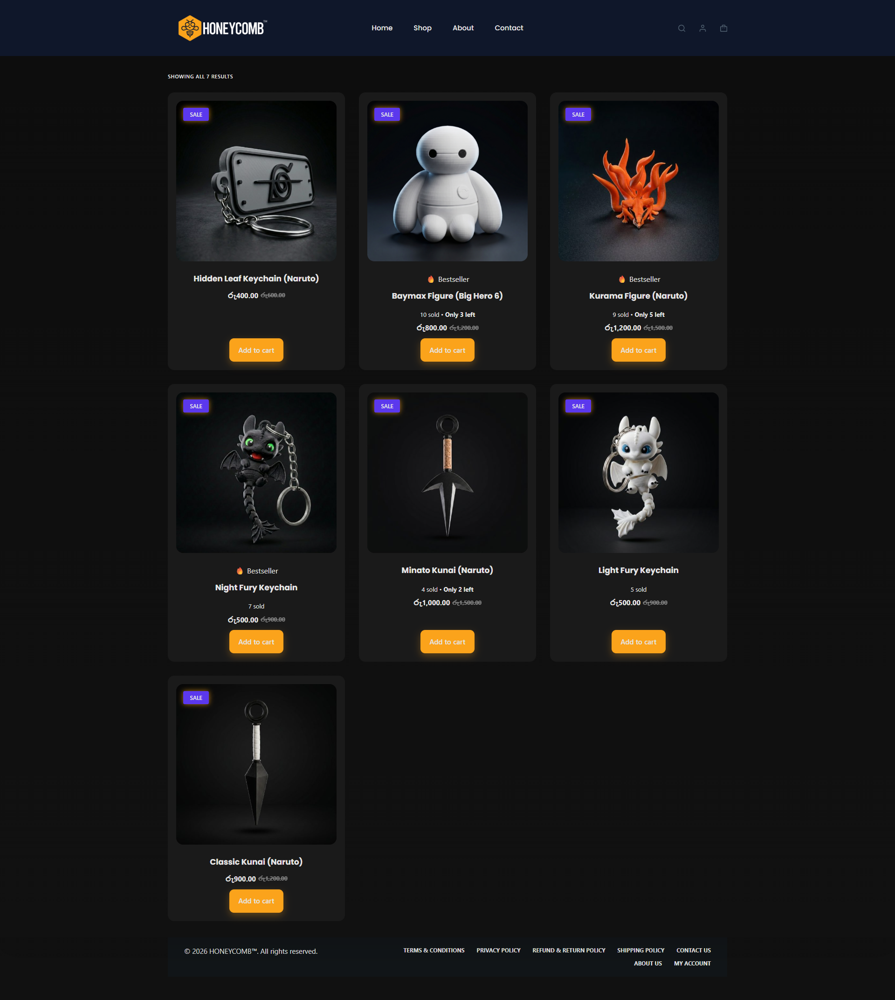
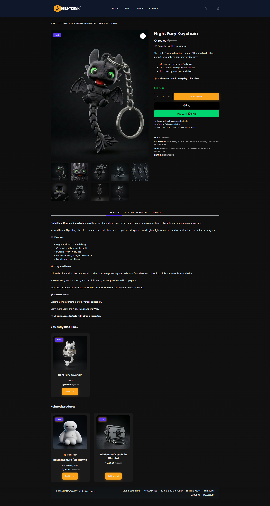
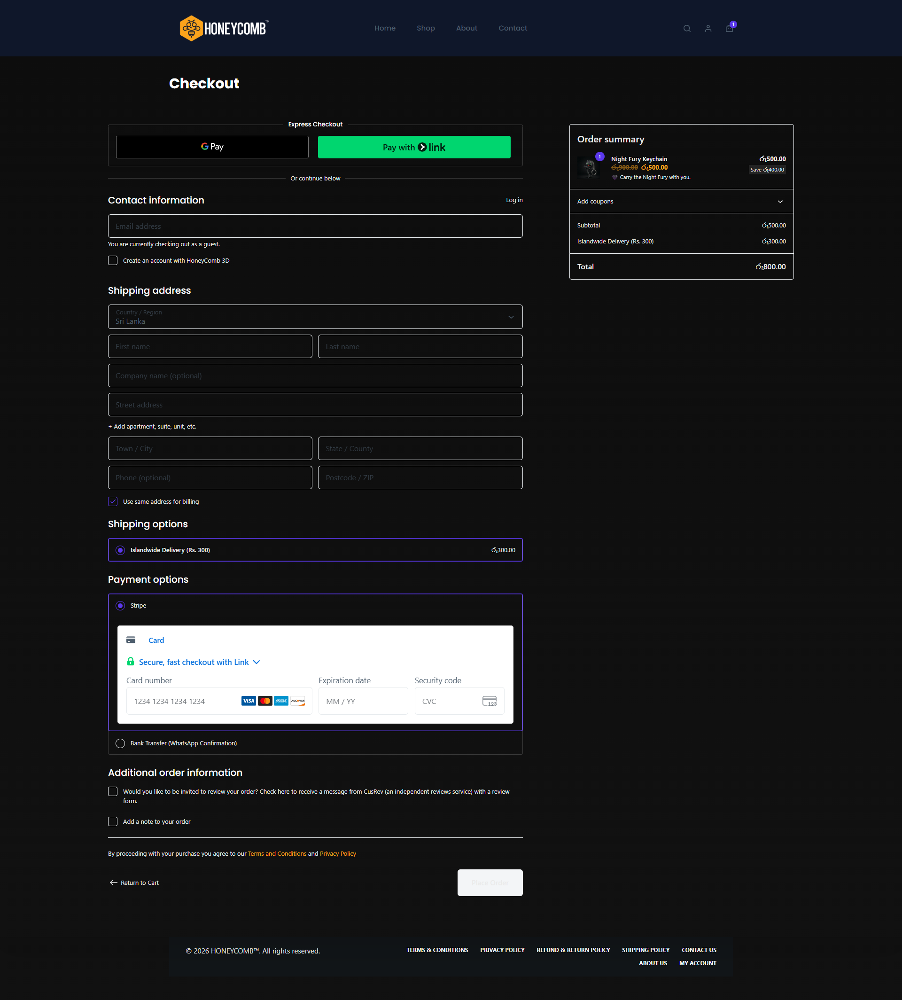

# Honeycomb 3D Store 🚀

> Built and optimized a real-world e-commerce system focused on conversions, trust, and user experience.

A conversion-focused e-commerce store built for anime collectible lovers in Sri Lanka.

🔗 Live Site: https://honeycomb3d.store

---

## 💡 Role & Contribution

Independently built and optimized a full e-commerce system, focusing on conversion optimization, payment integration, and trust-building mechanisms.

**Key responsibilities:**

* Store setup and configuration (WooCommerce)
* UI/UX improvements for better product focus
* Stripe payment gateway integration
* Email system setup using SMTP (FluentSMTP)
* Trustpilot review automation (via email logic)

---

## 📈 Real-World Application

This project is a live store designed to generate actual sales, not just a demo.

It applies real-world e-commerce principles such as:

* Conversion optimization
* Customer trust building
* Friction reduction in checkout

---

## 🧠 Project Overview

The store is designed to:

* Sell 3D printed anime collectibles
* Optimize product pages for conversions
* Use psychological triggers to influence buying decisions

---

## 🔄 System Flow

User browses products → selects item → adds to cart
→ proceeds to checkout → completes payment (Stripe or COD)
→ receives order confirmation email (SMTP)
→ Trustpilot review request is triggered → customer feedback collected

---

## ⚔️ Key Features

* 🔥 Stripe payment integration
* 📦 Cash on Delivery (COD)
* ⚡ Low stock + “X sold” urgency system
* 💬 WhatsApp direct customer contact
* ⭐ Trustpilot review automation
* 🌙 Dark UI optimized for product focus

---

## 🛠 Tech Stack

* WordPress
* WooCommerce
* Blocksy Theme
* FluentSMTP (Email system)
* Stripe (Payments)

---

## 🎯 What I Optimized

Focused on **conversion psychology**, not just design:

* Product hierarchy (best sellers prioritized)
* Scarcity triggers (“Only X left”)
* Social proof (“X sold” indicators)
* Clean UI for faster decision-making
* Reduced checkout friction

---

## 🧩 Problems Solved

* Low trust in new stores → Implemented review system (Trustpilot)
* Cart abandonment → Simplified checkout + added COD
* Weak product appeal → Improved visuals and hierarchy
* Lack of urgency → Added stock indicators and demand signals

---

## 📸 Screenshots

### Homepage

### Shop Page

### Product Page

### Checkout Page

---

## ⚙️ Custom Work

* CSS fixes for UI consistency
* Product card and layout optimization
* Trustpilot automated review system (BCC logic)
* SMTP email system configuration

---

## 🧠 Summary

This project demonstrates the ability to build and optimize a real-world e-commerce system with a strong focus on conversions, user experience, and trust.
